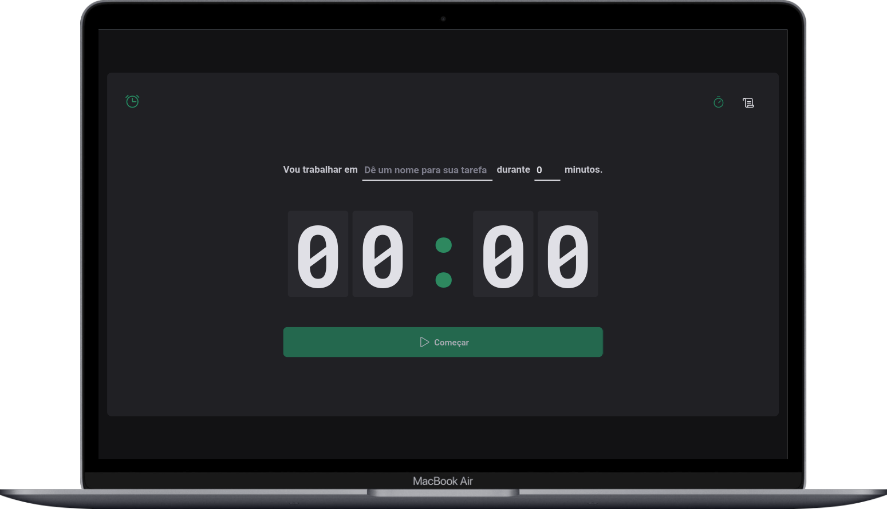
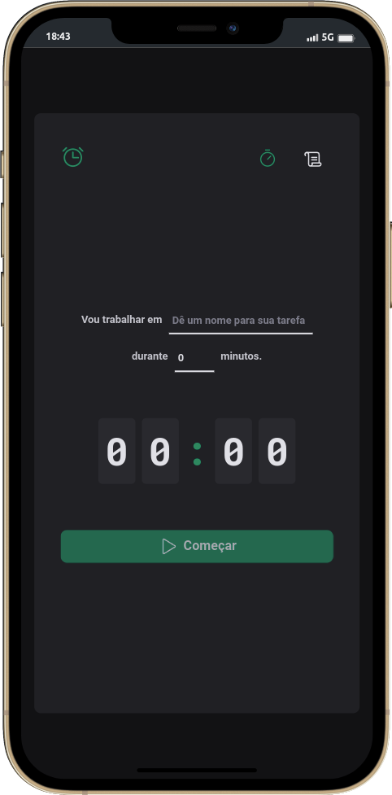

<h1 align="center">PomoTimer</h1>

	🚀Completed project 🚀

  <a href="#-application-video">Application video</a>&nbsp;&nbsp;&nbsp;|&nbsp;&nbsp;&nbsp;
  <a href="#-technologies">Technologies</a>&nbsp;&nbsp;&nbsp;|&nbsp;&nbsp;&nbsp;
  <a href="#-project">Project</a>&nbsp;&nbsp;&nbsp;|&nbsp;&nbsp;&nbsp;
  <a href="#-layout">Layout</a>&nbsp;&nbsp;&nbsp;|&nbsp;&nbsp;&nbsp;
  <a href="#-Author">Author</a>&nbsp;&nbsp;&nbsp;|&nbsp;&nbsp;&nbsp;
  <a href="#-License">License</a>

  

  &nbsp;&nbsp;
  &nbsp;&nbsp;
  

 

<h2>
   💻 desktop
</h2>

&nbsp;

  

&nbsp;

<h2>
   📱 Mobile
</h2>

&nbsp;

  

&nbsp;

<h2>
  🎥 Application video
</h2>

&nbsp;

&nbsp;

## 🚀 Technologies and Frameworks 
This project was developed with the following technologies and frameworks:

- HTML
- [JavaScript](https://www.javascript.com/)
- [React](https://react.dev/)
- [TypeScript](https://www.typescriptlang.org/)
- [Vite](https://vitejs.dev/)
- [styled-components](https://styled-components.com/)
- [react-hook-form](https://www.react-hook-form.com/)
- [react-router](https://reactrouter.com/en/main)
- [date-fns](https://date-fns.org/)
- [immer](https://github.com/immerjs/immer)
- [phospor-react](https://github.com/phosphor-icons/react)
- [zod](https://zod.dev/)
- [uuid](https://www.npmjs.com/package/uuid)

 

## 💻 Project
PomoTimer is a timer created to apply the famous focus technique, called "pomodoro". With this technique, the user can stipulate a certain time for the accomplishment of a task. 
 
With PomoTimer the user can:

- Give a name to the task you want to perform;
- Start a time cycle between 5 to 60 minutes;
- Interrupt a time loop if necessary;
- Check the history of completed, interrupted and ongoing cycles;

To access the website [Click here](https://pomotimer-v1.netlify.app/)

 

## 🔖 Layout
You can view the project layout through [FROM THIS LINK](https://www.figma.com/file/SsznAkUoZbap17uzZXnnpH/PomoTimer?type=design&node-id=0%3A1&mode=design&t=eCZV68E5VzoBEt1n-1). You must have an account with [Figma](https://figma.com) to access it.

 

## 👨‍💻 Author

<a href="https://www.linkedin.com/in/daniel-guimaraes-vieira/">
 
  
 <b>Daniel Guimarães</b></a> <a href="https://www.linkedin.com/in/daniel-guimaraes-vieira/" title="Author Daniel">🚀</a>
  

 

## 📝 License

This project is under license [MIT](./LICENSE).

---

Made with ❤️ by Daniel Guimarães 👋🏽 [Get in touch!](https://www.linkedin.com/in/daniel-guimaraes-vieira/)